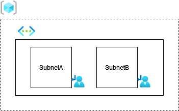

# Virtual Network with two Subnets

This Terraform template deploys the following resources within an Azure subscription.

* Resource Group
* Virtual Network
* Two Subnets within the Virtual Network
* Two Route Tables associated to the subnets
* Route Tables rules that routes traffic through a mock NVA

    

